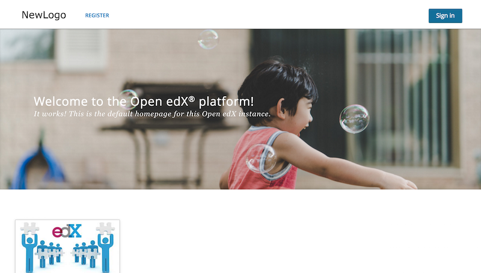

# starter-theme-openedx

Starter theme for developing comprehensive theme on Open edX

## How to compile a theme
http://edx.readthedocs.io/projects/edx-installing-configuring-and-running/en/latest/configuration/changing_appearance/theming/compiling_theme.html

## How to debug edxapp
https://openedx.atlassian.net/wiki/spaces/OpenOPS/pages/49873839/Debugging+Edxapp

## How to use

1. Change to `edxapp` user

		$ sudo -u edxapp bash

2. Create new folder on `/edx/app/edxapp/` called `themes`

		$ mkdir /edx/app/edxapp/themes

3. Move to that folder

		$ cd /edx/app/edxapp/themes

4. Clone this repo

		$ git clone https://github.com/peanutou/dolphin-theme.git dolphin-theme

5. Make some changes in `lms.env.json` located in `/edx/app/edxapp/`. Then change some variables to this:

		ENABLE_COMPREHENSIVE_THEMING: true,
		COMPREHENSIVE_THEME_DIRS: ["/edx/app/edxapp/themes"],
		DEFAULT_SITE_THEME: "dolphin-theme",

6. Back to ubuntu sudo users, and restart the edxapp to load new configuration.

		$ exit
		$ sudo /edx/bin/supervisorctl restart edxapp:

7. Run the `update.sh` script. To apply the themes.

		$ cd /edx/app/edxapp/themes/dolphin-theme/
		$ sh update.sh

